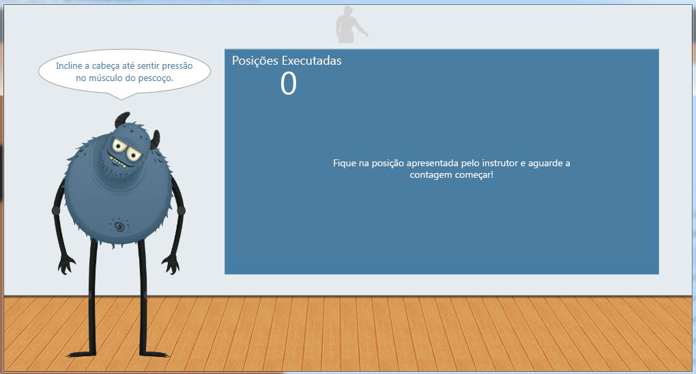
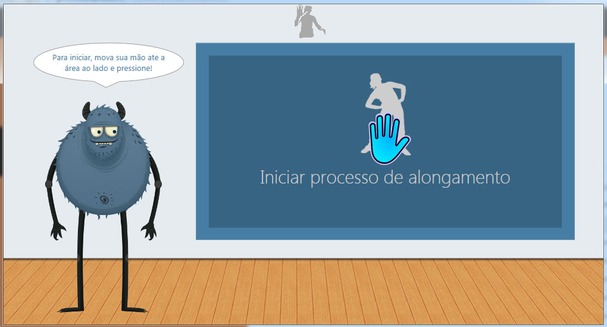

Kinect Body Position
====================

A PoC based on Kinect SDK to recognize body positions and guide users into stretching.

Here is the paper: https://github.com/ghophp/kinect-body-position/blob/master/documentation/finalpaper.pdf

## Screenshots

## License

This code is under the MIT license.
